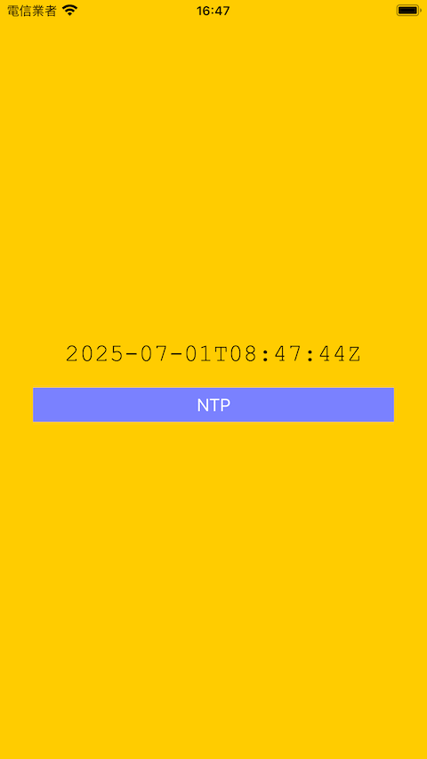

# WWNtpClient
[](https://developer.apple.com/swift/) [](https://developer.apple.com/swift/)  [](https://developer.apple.com/swift/) [](https://developer.apple.com/swift/)

### [Introduction - 簡介](https://swiftpackageindex.com/William-Weng)
- [Get NTP (Network Time Protocol) time.](https://www.rfc-editor.org/rfc/rfc5905.html)
- [取得NTP(Network Time Protocol)時間。](https://zh.wikipedia.org/zh-tw/網路時間協定)



### [Installation with Swift Package Manager](https://medium.com/彼得潘的-swift-ios-app-開發問題解答集/使用-spm-安裝第三方套件-xcode-11-新功能-2c4ffcf85b4b)

```bash
dependencies: [
    .package(url: "https://github.com/William-Weng/WWNtpClient.git", .upToNextMajor(from: "1.0.0"))
]
```

### Function - 可用函式
|函式|功能|
|-|-|
|connect(ntp:result:)|取得NTP-Server上的時間|
|connect(ntp:)|取得NTP-Server上的時間|

### Example
```swift
import UIKit
import WWNtpClient

final class ViewController: UIViewController {
    
    @IBOutlet weak var timeLabel: UILabel!
    
    @IBAction func getNtpTime(_ sender: UIButton) {
        
        Task {
            let result = await WWNtpClient.shared.connect()
            
            switch result {
            case .failure(let error): timeLabel.text = error.localizedDescription
            case .success(let date): timeLabel.text = date.ISO8601Format()
            }
        }
    }
}
```
